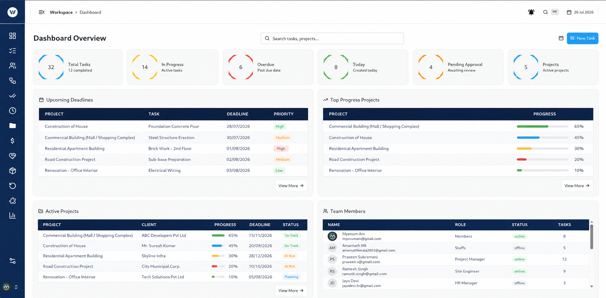

<p align="center">
  
</p>

# MyWorkSpace — A Unified Collaboration & Business Management Platform

<p align="center">
  <a href="https://github.com/"></a>
  <a href="https://github.com/"></a>
  <a href="#"></a>
  <a href="#"></a>
  <a href="#"></a>
  <a href="#"></a>
</p>

<p align="center">
  <b>Prepared for clients, partners, and stakeholders.</b>
</p>

<p align="center">
  <i>This document provides a complete overview of the MyWorkSpace platform — its purpose, structure, functionality, and the value it delivers.</i>
</p>

---

## Table of Contents

1. [What Is MyWorkSpace? (In Plain Words)](#what-is-myspace-in-plain-words)
2. [Executive Summary](#1-executive-summary)
3. [Project Overview](#2-project-overview)
4. [Core Features](#3-core-features)
5. [How the Platform Works](#4-how-the-platform-works)
6. [Real-World Problems the Platform Solves](#5-real-world-problems-the-platform-solves)
7. [Key Benefits](#6-key-benefits-of-myspace)
8. [Industries That Can Use MyWorkSpace](#7-industries-that-can-use-myspace)
9. [Quick Facts at a Glance](#quick-facts-at-a-glance)

---

## What Is MyWorkSpace? (In Plain Words)

MyWorkSpace is a **SaaS (Software as a Service) product** — a cloud-based application your organisation pays to use, with nothing to install and nothing to maintain. You simply sign in with a browser and your team starts working.

**Its purpose is simple:** to replace the 4–6 separate tools most companies juggle every day — one app for tasks, another for chat, another for files, another for invoicing — with **one single platform that does everything in one place**.

| Instead of using... | MyWorkSpace provides... |
|---|---|
| Slack / Teams | Real-time chat, audio & video calls |
| Asana / Trello | Tasks, projects, boards, deadlines |
| Google Drive / Dropbox | Secure file storage, shared folders |
| QuickBooks / Xero (partly) | Invoices, budgets, payment reminders |
| A separate HR tool | Attendance, leave, time tracking |
| Email back-and-forth | Approvals with a clear chain and audit trail |

**Who is it for?** Any organisation — small teams, growing companies, and industries like construction and engineering that need extra structure (change orders, RFIs, drawings).

**What problem does it solve?** Fragmentation. Today, information is scattered across tools: files in one app, conversations in another, tasks in a third. This costs time, causes mistakes, stalls approvals, and leaves leaders without a clear picture. MyWorkSpace solves this by giving every team member **one login, one workspace, and one source of truth**.

**What is the outcome?** Faster execution, clearer accountability, less administrative work, and a better experience for employees, managers, clients, and contractors alike.

<table align="center">
  <tr>
    <td align="center" width="25%"><b>9</b><br/>Modules in one platform</td>
    <td align="center" width="25%"><b>1</b><br/>Login for everything</td>
    <td align="center" width="25%"><b>100%</b><br/>Real-time visibility</td>
    <td align="center" width="25%"><b>24/7</b><br/>Automated reminders & reports</td>
  </tr>
</table>

> **Note:** MyWorkSpace is a paid, cloud-hosted SaaS subscription — no servers to buy, no software to install, no IT team required. You pay a predictable monthly fee and everything is managed for you.

---

## 1. Executive Summary

| | |
|---|---|
| **What it is** | A full-stack collaboration & business management platform |
| **What it does** | Unifies people, projects, clients, files, communication, and billing |
| **How you get it** | SaaS — cloud-hosted, browser-based, single sign-on |
| **Who it helps** | Executives, managers, teams, HR, finance, clients, contractors |
| **Why it matters** | Removes tool-hopping, silos, stalled approvals, and reporting overhead |

MyWorkSpace is a comprehensive, full-stack collaboration and business management platform that unifies an organisation's people, projects, clients, files, communication, and billing into a single, secure digital workspace. In today's business environment, teams frequently rely on a disconnected patchwork of tools — one application for task management, another for messaging, a third for file storage, and yet another for invoicing. This fragmentation creates context-switching costs, duplicated data entry, and visibility gaps that slow down decision-making and drain productivity.

MyWorkSpace solves this problem by consolidating the essential functions of a modern organisation into one cohesive platform. Instead of assembling a suite of point solutions and maintaining integrations between them, organisations adopt a single environment where every team member works within the same shared context. The result is faster execution, clearer accountability, reduced operational overhead, and a significantly improved experience for employees, managers, clients, and contractors alike.

---

## 2. Project Overview

### The Concept

At its core, MyWorkSpace is built on a simple but powerful idea: the workplace should not be scattered across multiple tools and logins. The platform brings together task and project management, real-time communication, secure file storage, calendar and scheduling, approvals, time tracking, client management, and billing — all accessible through a single sign-on and a single, consistent interface.

The platform is role-aware by design. Different users — executives, project managers, team members, staff, HR, finance, clients, and contractors — see a workspace tailored to their responsibilities. Permissions are granular and configurable, which means the right people always have the right access, and sensitive information remains protected.

### Purpose

The purpose of MyWorkSpace is threefold. First, it centralises operations so that all work-related information lives in one place. Second, it automates repetitive administrative tasks such as invoice reminders, approval routing, and attendance tracking so that teams can focus on high-value work. Third, it provides full visibility into what is happening across the organisation in real time, empowering leaders with the data they need to make confident decisions.

| Purpose Pillar | What it means in practice |
|---|---|
| **Centralise** | Every document, task, and conversation lives in one shared workspace |
| **Automate** | Reminders, approval routing, and attendance run by themselves |
| **Visualise** | Leaders see live data and reports without manual compilation |

<p align="center">
  
</p>

---

## 3. Core Features

MyWorkSpace is a genuinely broad platform, and its feature set reflects the full lifecycle of business operations.

| # | Feature | What you get |
|---|---|---|
| 1 | **Unified Communication** | Chat, audio/video calls, presence |
| 2 | **Task & Project Management** | Boards, timelines, assignments |
| 3 | **People, HR & Workforce** | Attendance, leave, workloads |
| 4 | **Secure File Management** | Shared folders, versions, previews |
| 5 | **Approvals & Audit** | Approval chains, audit trail |
| 6 | **Calendar & Scheduling** | Shared calendar, reminders |
| 7 | **Billing, Invoices & Budgets** | Invoices, reminders, budgets |
| 8 | **Client & Contractor Mgmt** | Directory, client portal |
| 9 | **Construction Module** | Change orders, RFIs, AutoCAD |

### Unified Communication

The platform includes real-time team messaging with audio and video calling, enabling instant collaboration whether teams are in the same office or spread across the globe. Presence indicators and live status updates make it easy to see who is available, while chat channels keep conversations organised by team, project, or topic.

### Task and Project Management

Smart task boards allow teams to organise work, set timelines, assign ownership, and track progress from start to finish. Projects can be broken into manageable tasks, connected to teams and staff, and monitored through clear status visibility. This gives every stakeholder a transparent view of what is being done, by whom, and when it will be delivered.

### People, HR, and Workforce Management

MyWorkSpace includes employee and staff management, attendance tracking, leave and time-off handling, and time and workload reporting. Managers can assign staff and contractors to projects, monitor workload distribution, and ensure that work is balanced across the team.

### Secure File Management

The platform provides secure cloud storage with shared team folders, granular access controls, file versioning, and structured approval flows for uploads. Documents, drawings, and media can be previewed directly in the browser, eliminating the need to download files and break the workflow.

### Approvals and Audit

Approval chains are a first-class feature. Requests can be routed through a configurable approval hierarchy, and every approval or rejection is captured with a timestamp. A complete audit trail accompanies every sensitive action, giving organisations the accountability and compliance they need.

### Calendar and Scheduling

A shared workspace calendar keeps everyone aligned on meetings, deadlines, appointments, and reminders. Scheduling becomes a collaborative activity rather than a private exercise, reducing missed deadlines and double-bookings.

### Billing, Invoices, and Budgets

The platform supports interactive invoice creation, automated payment reminders, budget tracking, spend visibility, receipts, and payment history. Custom templates and branding ensure that outgoing documents reflect the organisation's identity, while automated reminders reduce the time spent chasing payments.

### Client and Contractor Management

A unified directory manages clients and contractors, with project and engagement history attached to each relationship. This gives organisations a complete view of every external relationship and the work associated with it.

### Industry-Specific Module

Beyond the core workspace, MyWorkSpace includes a specialised construction module: change orders and RFI management with drawing and weight tables, contractors and departments, and an AutoCAD plugin — everything a construction project needs to keep documentation accurate and approvals moving.

---

## 4. How the Platform Works

### The User Workflow

```
Sign in (SSO) ──> Role identified ──> Tailored workspace ──> Work, chat, approve, invoice ──> Live updates everywhere
```

The user journey begins with a secure sign-in. Users authenticate through Google, GitHub, LinkedIn, or email and password credentials, and the platform identifies their role. From the moment they enter, the interface is tailored to their responsibilities — a project manager sees task boards and team workloads, a finance user sees invoices and budgets, and a client sees the portal relevant to their engagement.

| Role | Sees first |
|---|---|
| Project Manager | Task boards, team workloads, approvals |
| Finance | Invoices, budgets, receipts |
| Client | Their projects & invoices (portal) |
| HR | Attendance, leave, staff records |

Once inside, users move fluidly between features. A team member can accept a task assigned to them, message a colleague for clarification, upload a deliverable to the project's shared folder, and submit it for approval — all without leaving the workspace. Managers can review the approval queue, monitor time entries and workload reports, and send invoices with payment reminders from the same environment. Because all actions happen in one place, information is never duplicated and nothing is lost between tools.

### The Operational Flow

```
Create ──> Assign ──> Execute ──> Review/Approve ──> Bill ──> Report
   ^                                                        |
   └──────────────────── Loop continues ────────────────────┘
```

Operationally, the platform functions as a real-time system. Work is created, assigned, executed, reviewed, and billed within a continuous loop. Task status updates, chat messages, calendar events, and approval decisions propagate instantly across the workspace, so every stakeholder operates from the same, current picture. Administrative functions such as reminders, notifications, and routine reporting run automatically, reducing manual effort and the risk of human error.

---

## 5. Real-World Problems the Platform Solves

Modern organisations lose significant time and money to operational fragmentation. Employees switch between multiple applications dozens of times each day, and every switch is a moment of lost focus. Information gets siloed, approvals stall because documents are in the wrong tool, and managers lack a single source of truth for what is actually happening.

| Problem | How MyWorkSpace solves it |
|---|---|
| **Tool-hopping** | All features consolidated into one platform |
| **Information silos** | Every document, task, and decision in one shared workspace |
| **Stalled approvals** | Built-in approval chains with visibility and automatic notifications |
| **Reporting overhead** | Reports generated in real time from the system of record itself |
| **Trust & accountability** | Role-based access control + complete audit trails |

The platform also solves a critical trust problem. With role-based access control and complete audit trails, organisations can demonstrate exactly who did what, when, and why — a requirement in contract-heavy industries where accountability is paramount.

---

## 6. Key Benefits of MyWorkSpace

### Efficiency Improvements

The most immediate benefit is a dramatic reduction in operational friction. By working in a single platform, teams avoid duplicated data entry, endless file transfers, and context-switching between tools. Tasks move through approval chains faster, invoices are generated and dispatched more quickly, and reporting that once took hours is produced instantly from live data.

### Cost Savings

Consolidating multiple point solutions into one platform reduces software licensing costs, integration maintenance, and the administrative overhead of managing several vendors. Automation of routine functions such as reminders and attendance reduces the labour cost associated with administrative work. Centralised visibility also reduces the cost of errors — missed deadlines, lost documents, and delayed billing are far less likely when everything is tracked in one system.

### Scalability

MyWorkSpace is architected to grow with the organisation. The modular design means new teams, projects, and clients can be added without restructuring. The technology foundation — MongoDB, Redis, and RabbitMQ with containerised deployment — is designed for high performance and horizontal scaling, allowing the platform to serve anything from a small team to a large enterprise.

### Automation Capabilities

The platform automates the repetitive work that consumes administrative time. Invoice payment reminders are sent automatically, approval requests are routed to the right people, uploads follow structured review flows, and routine status and workload reports are generated without manual compilation. Automation reduces turnaround times and frees staff to focus on work that requires judgment and creativity.

### User Experience Advantages

A unified interface with role-based customisation means every user sees a clean, relevant, and intuitive workspace. Reduced tool-switching lowers cognitive load, and the consistent design language means users learn the platform once and apply that knowledge everywhere. The result is higher adoption, less training, and a more satisfying daily working experience.

| Benefit | Outcome |
|---|---|
| **Efficiency** | Less friction — fewer switches, faster approvals, instant reports |
| **Cost savings** | Fewer tools to license, less admin labour, fewer costly errors |
| **Scalability** | Grows from small team to enterprise without restructuring |
| **Automation** | Reminders, routing, and reports run themselves |
| **Experience** | One clean interface, one login, learned once |

---

## 7. Industries That Can Use MyWorkSpace

MyWorkSpace is designed to adapt to the operational realities of the industries it serves, delivering concrete value in each.

### Construction and Engineering

Construction projects are defined by coordination, documentation, and accountability. MyWorkSpace gives construction firms a single environment for projects, tasks, drawings, and change orders. RFIs and change orders can be raised, reviewed, and approved with full audit trails, while drawing and weight tables keep the documentation accurate. Teams in the field and in the office stay aligned on the same files and schedules, reducing rework, disputes, and administrative overhead.

For contractors and subcontractors, the platform provides a unified directory with engagement history, so every project relationship is documented. For departments and teams on site, task boards, attendance tracking, and time reporting keep work visible and balanced. And for finance, invoicing with automated reminders accelerates payment on completed work. The AutoCAD plugin keeps drawings in the workflow, so documentation never has to leave the system to stay current.

The net result is a construction operation where projects are delivered with better coordination, clearer accountability, and lower administrative burden — from the first drawing to the final invoice.

---

## Quick Facts at a Glance

| Category | Detail |
|---|---|
| **Product type** | SaaS — cloud-hosted, browser-based |
| **Core modules** | 9 (communication, projects, HR, files, approvals, calendar, billing, clients, construction) |
| **Sign-in options** | Google, GitHub, LinkedIn, email/password |
| **Who uses it** | Executives, managers, team members, HR, finance, clients, contractors |
| **Key industries** | Construction, engineering, professional services, general business |
| **Tech foundation** | React, Node.js, MongoDB, Redis, RabbitMQ, Docker/Kubernetes |
| **Availability** | Any modern browser; mobile-responsive |
| **Security** | Role-based access control, audit trails, secure cloud storage |
| **Onboarding time** | Productive on day one; full migration in ~4 weeks |

---

<p align="center">
  
</p>

<p align="center">
  <b>MyWorkSpace</b> — Your entire workplace. One workspace.<br/>
  <i>For more information, pricing, or a live demo, contact our team.</i>
</p>

<p align="center">
  <a href="#"></a>
  <a href="#"></a>
  <a href="#"></a>
  <a href="#"></a>
</p>
