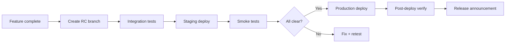
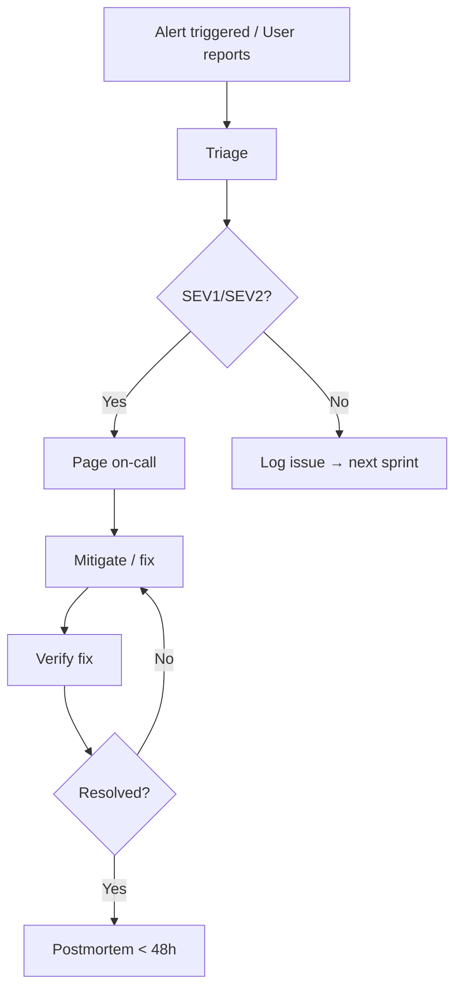

# Production Operations Plan — MyWorkSpace GA

---

## 1. Release Management

### 1.1 Release Cadence

| Type | Frequency | Process | Approvals | Downtime |
|------|-----------|---------|-----------|----------|
| Patch (hotfix) | As needed | Emergency PR → review → deploy | 1 approver | Zero (rolling) |
| Minor (features) | Bi-weekly | Sprint → RC → staging → production | 2 approvers + QA sign-off | Zero |
| Major (breaking) | Monthly | Extended testing → staging soak → phased rollout | CTO + Product + QA | Planned window |

### 1.2 Release Process



### 1.3 Release Checklist

- [ ] All tests pass (unit + integration)
- [ ] `tsc --noEmit` passes (frontend + backend)
- [ ] `npm run build` passes (frontend + backend)
- [ ] Changelog updated
- [ ] Version bumped (semver)
- [ ] Database migration written (if schema change)
- [ ] Migration tested on staging
- [ ] Monitoring dashboards reviewed
- [ ] Rollback plan confirmed
- [ ] Support team notified
- [ ] Release tagged in git
- [ ] Docker images pushed to registry
- [ ] Staging deployed and verified
- [ ] Production deployed (zero-downtime)
- [ ] Post-deploy smoke tests pass
- [ ] Release notes published

---

## 2. Incident Management

### 2.1 Incident Severity Definitions

| Severity | Definition | Response Time | Resolution Time | Escalation |
|----------|-----------|---------------|-----------------|------------|
| **SEV1** | Complete outage, data loss, security breach | 15 min | 4 hours | CTO + Engineering Lead |
| **SEV2** | Major feature degradation, partial outage | 1 hour | 24 hours | Engineering Lead |
| **SEV3** | Minor feature issue, no workaround | 4 hours | 5 business days | Team Lead |
| **SEV4** | Cosmetic, documentation, nice-to-have | 24 hours | Next sprint | Product Manager |

### 2.2 Incident Flow



### 2.3 On-Call Rotation

| Role | Schedule | Responsibility |
|------|----------|---------------|
| Primary SRE | Weekdays 9-5, Week 1 | First responder |
| Secondary SRE | Weekdays 5-9, Week 1 | Backup, handles non-critical |
| Night/weekend SRE | Week 2 | 24/7 coverage |
| Engineering lead | Always | Escalation for complex issues |

### 2.4 Postmortem Process

Required for all SEV1 + SEV2 incidents. Template:
```markdown
# Postmortem: YYYY-MM-DD - Title
Severity: SEV1/SEV2
Date: YYYY-MM-DD
Duration: X hours X minutes
Impact: X users, X% error rate, X minutes downtime

## Timeline
| Time | Event |
|------|-------|

## Root Cause

## Contributing Factors

## Resolution

## Action Items
| # | Item | Owner | Due |
|---|------|-------|-----|

## Lessons Learned

## Preventative Measures
```

---

## 3. Maintenance Windows

### 3.1 Standard Maintenance Window

| Day | Time (UTC) | Typical Operations |
|-----|------------|-------------------|
| Tuesday | 02:00–04:00 | Minor releases, optional updates |
| Thursday | 02:00–04:00 | Patches, urgent fixes |
| Emergency | Any | Security patches, critical fixes |

### 3.2 Change Types and Windows

| Change Type | Approval | Window | Downtime | Communication |
|-------------|----------|--------|----------|---------------|
| Standard (low risk) | Pre-approved | Any business hour | Zero (rolling) | Slack #engineering |
| Normal (medium risk) | Engineering lead | Tue/Thu 02-04 UTC | Zero (rolling) | 24h notice in #engineering |
| Emergency (high risk) | CTO + Lead | Any time | Minimal | Immediate Slack + PagerDuty |
| Database migration | CTO + DBA | Tue 02-04 UTC | Zero (if backward compat) | 48h notice + runbook review |

### 3.3 Maintenance Types

| Type | Frequency | Expected Duration | User Impact |
|------|-----------|-------------------|-------------|
| OS security patches | Monthly | 5-10 min (rolling) | Zero |
| Redis restart | Quarterly | < 30s | Brief cache miss |
| MongoDB minor upgrade | Quarterly | 5-15 min | Brief read replica lag |
| SSL cert renewal | Every 60 days | Zero (auto) | Zero |
| Backup restore test | Quarterly | 1-2 hours (test env) | Zero |
| Full DR test | Annually | 1-2 hours | Planned outage window |

---

## 4. Backup Verification Schedule

| Type | Frequency | Procedure | Success Criteria |
|------|-----------|-----------|-----------------|
| Automated backup | Every 6 hours | `scripts/cron-backup.sh` | File exists, non-zero, valid gzip |
| Backup integrity | Daily | `gunzip -t` on latest dump | Exit code 0 |
| Restore test | Weekly | Restore to test MongoDB | Document count matches |
| Full DR test | Quarterly | Full restore + app start | All services healthy |
| Retention audit | Monthly | Verify old backups deleted | No files older than 30 days |
| Offsite sync check | Weekly | Verify S3 sync completed | S3 bucket has today's files |

---

## 5. Capacity Planning

### 5.1 Monitoring Cadence for Capacity

| Metric | Monitor Frequency | Review Frequency | Growth Threshold |
|--------|------------------|------------------|------------------|
| API request rate | Real-time | Weekly | > 50% utilization |
| Active users (DAU) | Daily | Weekly | > 80% of per-user quota |
| Database size | Daily | Weekly | > 60% of allocated storage |
| Redis memory | Real-time | Weekly | > 70% of maxmemory |
| Disk usage | Real-time | Weekly | > 70% of disk |
| File storage (R2) | Daily | Monthly | > 60% of quota |
| Queue depth | Real-time | Weekly | > 50% of consumer capacity |
| Network throughput | Real-time | Monthly | > 50% of bandwidth |

### 5.2 Scaling Triggers

| Resource | Scale Up Trigger | Scale Down Trigger | Action |
|----------|-----------------|-------------------|--------|
| Backend pods | CPU > 70% for 5 min OR p95 > 1s for 5 min | CPU < 30% for 30 min | HPA (auto) |
| Frontend pods | CPU > 70% for 5 min | CPU < 30% for 30 min | HPA (auto) |
| MongoDB | Connections > 80% OR ops/s > 80% | — | Manual — upgrade tier |
| Redis | Memory > 70% OR evictions > 0/s | — | Manual — increase maxmemory or shard |
| RabbitMQ | Queue depth > 10000 | — | Manual — add consumers or cluster |
| Disk | Usage > 80% | — | Manual — add volume or cleanup |

---

## 6. Versioning Strategy

### 6.1 Semantic Versioning

```
vMAJOR.MINOR.PATCH
```

| Component | MAJOR | MINOR | PATCH |
|-----------|-------|-------|-------|
| **API** | Breaking schema change | New endpoints, non-breaking | Bug fixes, performance |
| **Frontend** | Breaking UI/UX redesign | New features | Bug fixes |
| **Database** | Schema migration (breaking) | New collections/fields | Index changes |
| **Infrastructure** | Architecture change | New service, config change | Patch, security fix |

### 6.2 Tagging Convention

```bash
# Code tags
git tag -a v1.0.0 -m "v1.0.0: Initial GA release"
git tag -a v1.1.0 -m "v1.1.0: Reporting module"
git tag -a v1.1.1 -m "v1.1.1: Fix timezone bug"

# Docker image tags
ghcr.io/myworkspace/backend:v1.0.0
ghcr.io/myworkspace/backend:latest
ghcr.io/myworkspace/frontend:v1.0.0
ghcr.io/myworkspace/frontend:latest
```

---

## 7. Hotfix Workflow

### 7.1 When to Hotfix

- SEV1/SEV2 production incident requiring immediate fix
- Security vulnerability (CVE with active exploit)
- Data corruption issue
- Production build is completely broken

### 7.2 Hotfix Process

```bash
# 1. Branch from production tag
git checkout v1.0.0
git checkout -b hotfix/issue-description

# 2. Fix and commit
git add -A
git commit -m "fix: description of the hotfix"

# 3. Run minimal validation
npm run test:unit        # Unit tests
npx tsc --noEmit         # Type check

# 4. Build and deploy
make deploy TAG=hotfix-$(date +%Y%m%d-%H%M)

# 5. After verification, merge back to main
git checkout main
git merge hotfix/issue-description
git push origin main

# 6. Postmortem within 48 hours
```

### 7.3 Hotfix SLA

| Step | Time |
|------|------|
| Triage | < 15 min |
| Fix development | < 2 hours |
| Review | < 30 min |
| Build + deploy | < 15 min |
| Verification | < 15 min |
| **Total (SEV1)** | **< 4 hours** |

---

## 8. Long-Term Support (LTS) Policy

### 8.1 Version Support

| Version | Status | Security Fixes | Bug Fixes | End of Life |
|---------|--------|----------------|-----------|-------------|
| v1.x | Active | ✅ | ✅ | TBD |
| v0.x (pre-GA) | Deprecated | ❌ | ❌ | At GA launch |

### 8.2 Deprecation Policy

- API endpoints: Marked `Deprecated` in response header for 1 minor version before removal
- Features: Announced 1 month before removal via in-app banner + email
- Breaking changes: Only in MAJOR version bumps
- Migration guides provided for all breaking changes

---

## 9. Security Operations

### 9.1 Routine Security Tasks

| Task | Frequency | Owner |
|------|-----------|-------|
| npm audit review | Weekly | Engineering |
| Dependency updates | Bi-weekly | Engineering |
| SSL cert check | Weekly | DevOps |
| Access key rotation | Quarterly | DevOps |
| Penetration test | Annually | Security team |
| Vulnerability scan | Monthly | DevOps |
| Log review (suspicious activity) | Daily | Security team |
| Rate limit effectiveness review | Monthly | Engineering |

### 9.2 Security Incident Response

See [INCIDENT-RESPONSE.md](./INCIDENT-RESPONSE.md) for detailed security incident procedures.

---

## 10. Communication Matrix

| Scenario | Channel | Recipients | Template |
|----------|---------|------------|----------|
| Scheduled maintenance | Email + Slack | All users | "MyWorkSpace maintenance on [date] at [time] — no downtime expected" |
| Incident detected | PagerDuty + Slack | On-call + #incidents | Automated alert |
| Incident resolved | Slack | #engineering + stakeholders | Summary + postmortem link |
| Release announcement | Slack + Email | All users | Changelog + migration notes |
| Security advisory | Email | All users + security contacts | Severity + mitigation + timeline |
| Emergency maintenance | Slack + Email | All active users | "Emergency maintenance — brief interruption expected" |
| Deprecation notice | In-app banner + Email | Affected users | "Feature X will be removed on [date] — migrate by [date]" |
