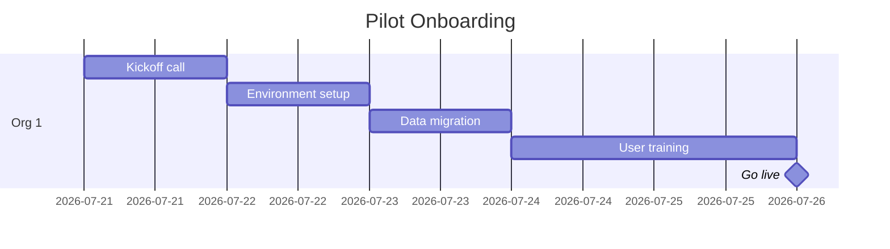
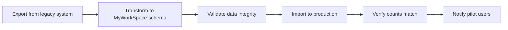
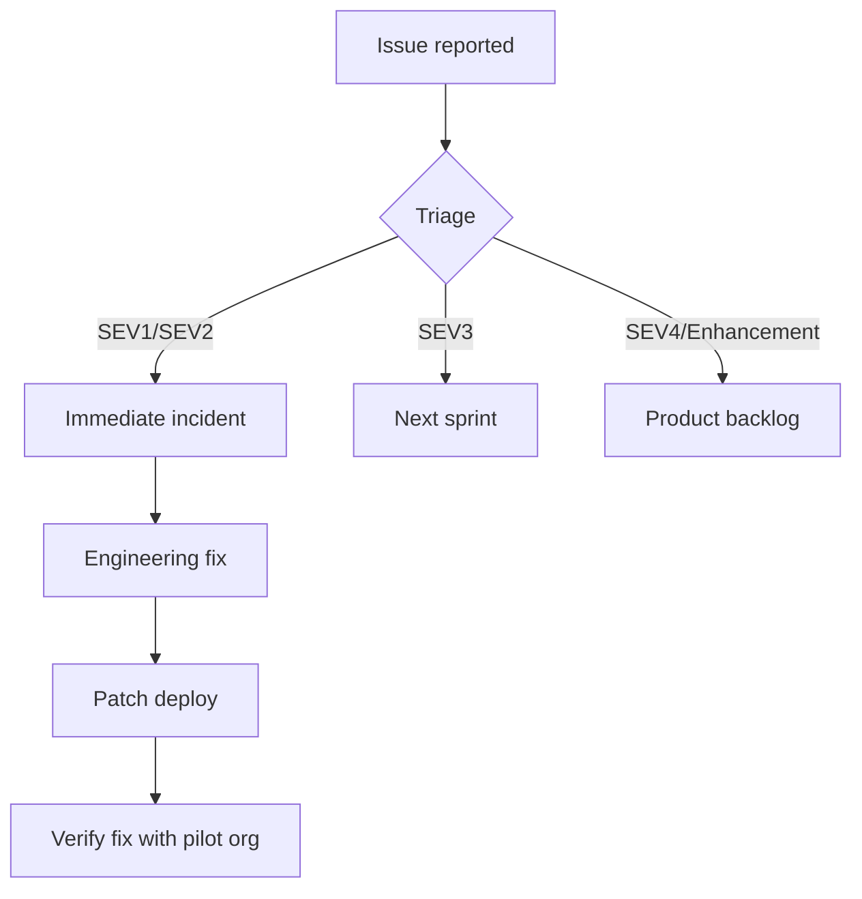

# Pilot Rollout Strategy — MyWorkSpace GA

## Overview

A phased pilot rollout with 3–5 organizations over 4 weeks to validate production readiness before full GA.

---

## Pilot Selection Criteria

### Organization Profile

| Criterion | Requirement | Rationale |
|-----------|-------------|-----------|
| Org size | 5–50 users | Meaningful scale without overwhelming risk |
| Industry mix | Min 2 different industries | Validate cross-domain suitability |
| Technical sophistication | Moderate+ | Can provide structured feedback |
| Willingness to test | Explicit agreement | Need active participation |
| Data sensitivity | Low–moderate | Reduce breach impact during pilot |
| Existing relationship | Warm/historical | Better communication, patience |

### Exclusion Criteria

- Organizations with > 200 users (too much blast radius)
- Highly regulated industries (finance, healthcare) unless compliance-verified
- Organizations with active legal disputes
- Orgs requesting custom features (pilot is for validation, not feature dev)

---

## Pilot Timeline

### Week 1: Onboarding



| Day | Activity | Owner |
|-----|----------|-------|
| D0 | Pilot kickoff call — scope, expectations, timeline | CSM |
| D1 | Create org, configure settings, set up SSO | DevOps |
| D2 | Migrate existing data (users, projects, files) | DevOps |
| D3 | Admin training session (2 hours) | CSM + Product |
| D4 | End-user training session (1 hour) + enablement materials | CSM |
| D5 | Go-live — switch to production MyWorkSpace | All |

### Week 2–3: Active Usage

| Activity | Frequency | Owner |
|----------|-----------|-------|
| Daily health check review | Daily | DevOps |
| Usage metrics review | Every 48h | Product |
| Weekly check-in call | Weekly | CSM |
| Issue triage & resolution | Continuous | Engineering |
| Feedback collection | Continuous | Product |

### Week 4: Evaluation

| Activity | Owner | Outcome |
|----------|-------|---------|
| Usage analysis report | Product | Adoption metrics per org |
| Performance report | DevOps | Latency, error rates, resource usage |
| Feedback synthesis | Product | Feature requests, UX improvements |
| Stability report | DevOps | Uptime, incidents, resolution times |
| Go/No-Go recommendation | Team | Launch recommendation to stakeholders |

---

## Onboarding Process

### Step 1: Environment Setup

```bash
# Create production tenant
export ORG_SLUG="pilot-org-name"
export ORG_PLAN="growth"

# Deploy tenant configuration
kubectl create configmap myworkspace-$ORG_SLUG-config \
  --from-literal=ORG_SLUG=$ORG_SLUG

# Verify isolation
curl -H "X-Org-Slug: $ORG_SLUG" https://api.myworkspace.myenum.in/api/health
```

### Step 2: Data Migration



**Migration Checklist:**
- [ ] Users exported + transformed (name, email, role)
- [ ] Projects migrated with dates and status
- [ ] Tasks migrated with assignments and comments
- [ ] Files transferred to R2 storage
- [ ] Time entries imported with dates
- [ ] Relationships preserved (task→project, user→team)
- [ ] Counts verified: `source.count === target.count`

### Step 3: Training & Enablement

| Artifact | Description | Delivered |
|----------|-------------|-----------|
| Admin quickstart guide | How to manage org, users, teams | D3 |
| End-user quick reference | Common tasks, time tracking, file sharing | D4 |
| Video tutorials | Walkthrough of key workflows | D4 |
| FAQ document | Common questions and answers | D4 |
| Support channel | Dedicated Slack channel | D0 |

---

## Usage Monitoring

### Metrics Collected

| Category | Metrics | Tool |
|----------|---------|------|
| Adoption | DAU/WAU/MAU, login frequency | Grafana |
| Engagement | Tasks created, files uploaded, time tracked | Grafana |
| Performance | API latency, error rate, page load time | Grafana |
| Feature usage | Feature adoption rate per module | Analytics |
| Support | Ticket volume, resolution time | Sentry + Support tool |
| Infrastructure | CPU, memory, disk, network | Prometheus |

### Dashboard

A pilot-specific Grafana dashboard with:
- Per-organization usage breakdown
- Active user count (real-time)
- Feature adoption heatmap
- API performance by endpoint
- Error rate by org

---

## Feedback Collection

### Channels

| Channel | Purpose | Cadence |
|---------|---------|---------|
| Weekly check-in call | Qualitative feedback, blockers | Weekly |
| In-app feedback widget | Bug reports, feature requests | Continuous |
| NPS survey | Satisfaction score at W2 + W4 | Bi-weekly |
| Support tickets | Issue tracking | Continuous |
| User interviews | Deep-dive on specific features | Week 3 |

### Feedback Taxonomy

| Type | Definition | Action |
|------|------------|--------|
| Bug | Functionality not working as designed | Fix within SLA |
| UX issue | Feature works but is confusing | Document for roadmap |
| Missing feature | Gap in functionality | Evaluate for GA scope |
| Performance | Slow or unresponsive | Investigate + optimize |
| Enhancement | "Would be nice to have" | Backlog for future |

---

## Issue Triage Process



### SLA Targets

| Priority | Response Time | Resolution Time |
|----------|---------------|-----------------|
| SEV1 — Critical | 15 min | 4 hours |
| SEV2 — High | 1 hour | 24 hours |
| SEV3 — Medium | 4 hours | 5 business days |
| SEV4 — Low | 24 hours | Next sprint |

---

## Pilot Success Criteria

### Quantitative (All Must Pass)

| Criterion | Target | Measurement |
|-----------|--------|-------------|
| Uptime | ≥ 99.9% | Uptime monitor |
| API p95 latency | ≤ 500ms | Prometheus |
| API error rate | ≤ 1% | Prometheus |
| User activation rate | ≥ 60% by W2 | Analytics |
| DAU/MAU ratio | ≥ 30% | Analytics |
| Task completion rate | ≥ 70% of created tasks are completed | Product analytics |
| NPS score | ≥ 30 | Survey |
| SEV1 incidents | 0 targeted to pilot | Incident log |
| SEV2 incidents | ≤ 3 total | Incident log |
| Support ticket resolution | 90% within SLA | Support tool |

### Qualitative (3 of 5 Must Pass)

| Criterion | Assessment |
|-----------|------------|
| "Would recommend to others" | ≥ 70% of pilot users |
| "Faster than previous system" | ≥ 60% of pilot users |
| "Easy to use" rating | ≥ 4/5 avg |
| Feature completeness | ≥ 80% of required features covered |
| Migration satisfaction | ≥ 4/5 avg |

---

## Rollback Conditions (Pilot)

The pilot organization will be rolled back to their previous system if:

1. **Any data loss** — user data permanently lost or corrupted
2. **Authentication down** > 2 hours
3. **3+ SEV1 incidents in any 7-day period**
4. **Performance consistently degraded** (p95 > 2s for 24h)
5. **Pilot org requests rollback** at any time

### Rollback Procedure

```bash
# 1. Notify pilot organization
# 2. Export current data
make backup

# 3. Restore legacy system
# 4. Verify data integrity
# 5. Postmortem
```

---

## Production Support Model (Pilot Phase)

### Support Team

| Role | Person | Hours | Channel |
|------|--------|-------|---------|
| DevOps on-call | Primary + Secondary | 24/7 | PagerDuty |
| Engineering lead | Tech lead | Business hours | Slack |
| CSM | Customer success | Business hours | Email + Slack |
| Product manager | Product owner | Business hours | Slack |

### Communication Channels

- **Pilot Slack channel**: `#myworkspace-pilot-{org}` — daily updates, questions
- **Internal channel**: `#myworkspace-pilot-internal` — triage, coordination
- **PagerDuty**: Critical alerts 24/7
- **Email**: pilot-support@myworkspace.com (archived, responded within 4 hours)

### Escalation Path

```
User reports issue
    → CSM triages (15 min)
        → SEV1/SEV2: PagerDuty pages on-call engineer
            → Engineer resolves (4h / 24h SLA)
        → SEV3+: Logged in issue tracker, next sprint
```

---

## Post-Pilot GA Recommendation

After Week 4, the pilot team produces a Go/No-Go recommendation:

### Go Criteria (ALL must pass)
- [ ] All quantitative success criteria met
- [ ] ≥ 3 of 5 qualitative criteria met
- [ ] No unresolved SEV1 findings
- [ ] All SEV2 findings have workaround or scheduled fix
- [ ] Performance within acceptable thresholds
- [ ] Pilot orgs willing to provide testimonial

### Conditional Go
If 1–2 quantitative criteria are slightly below target but trend is positive, launch with:
- Documented risks
- Mitigation plan with owners
- 7-day checkpoint after GA launch

### No-Go
If any rollback condition triggered, or > 2 quantitative criteria miss:
- Extend pilot by 2 weeks
- Address root causes
- Re-evaluate

```diff
+ Pilot Recommendation: [GO / Conditional / NO-GO]
+ Prepared by: _________________ Date: _________
+ Approved by: _________________ Date: _________
```
